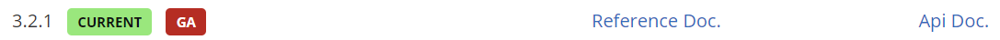
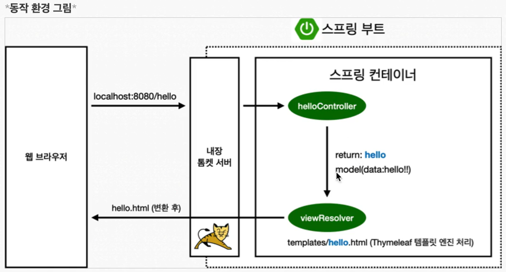
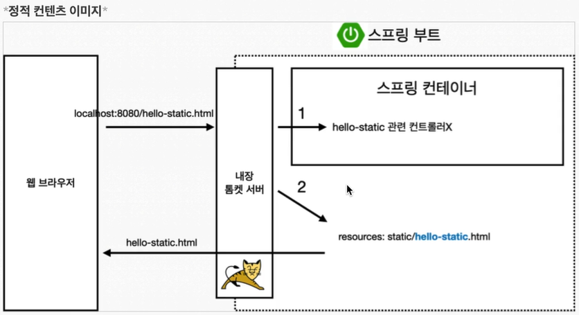

# 스프링 입문

## 1️⃣ 프로젝트 환경설정
### 01️ 프로젝트 생성
- Java 17
- IntelliJ


https://start.spring.io

**Project Metadata**
- Group : 기업 도메인명
- Artifact : build에 나올 때 결과물

**Dependencies**
- Thymeleaf : HTML을 만들어주는 템플릿 엔진

<br>

IntelliJ에서 `build.gradle` → `Open as Project`


- `.idea` : IntelliJ가 사용하는 설정 파일
- `gradle`
- `src`
    - `main`
        - `java` : 실제 패키지, 소스 파일
        - `resources` : Java 코드 파일 제외한 나머지 파일
    - `test` : 테스트 코드
- `build.gradle` : 중요!
    - mavenCentral() : 라이브러리를 받는 사이트

<br>

**HelloSpringApplication 실행**
- `Tomcat initialized with port 8080 (http)` → `localhost:8080`

<br>

Settings → gradle 검색 → `Build and run using` & `Run tests using` : `IntelliJ IDEA`

<br>

### 02 라이브러리 살펴보기


External Libraries : 불러온 라이브러리들

<br>

gradle, Maven 같은 툴들은 의존관계를 다 관리해줌. (필요한 것 다 불러옴.)


Dependencies : 라이브러리 간의 의존관계

<br>

**logging**
- `slf4j` : 쉽게 말해 인터페이스.
- 요즘엔 실제 로그를 어떤 구현체로 출력하느냐 → `logback`
- starter-logging 라이브러리를 불러오면 slf4j, logback 두 라이브러리도 자동으로 불러옴.

<br>

테스트할 때, JUnit 라이브러리 사용

<br>

| **정리**

**스프링부트 라이브러리**
- spring-boot-starter-web
    - spring-boot-starter-tomcat : 톰캣(웹서버)
    - spring-webmvc : 스프링 웹 MVC
- spring-boot-starter-thymeleaf : 타임리프 템플릿 엔진(View)
- spring-boot-starter(공통) : 스프링 부트 + 스프링 코어 + 로깅
    - spring-boot
        - spring-core
    - spring-boot-starter-logging
        -logback, slf4j

**테스트 라이브러리**
- spring-boot-starter-test
    - junit : 테스트 프레임워크
    - mockito : 목 라이브러리
    - assertj : 테스트 코드를 좀 더 편하게 작성하게 도와주는 라이브러리
    - spring-test : 스프링 통합 테스트 지원

<br>

### 03 View 환경설정

**스프링 필요한 기능 찾기!**

- `Welcome 페이지 찾기` : spring.io 에서 Projects > Spring Boot > LEARN > Documentation > Reference Doc. > Web > 1.1.6. Welcome Page

<br>

**thymeleaf 템플릿 엔진**<br>
템플릿 엔진을 쓰면 정적 페이지를 원하는 대로 바꿀 수 있음.<br>
(thymeleaf라는 템플릿 엔진 사용)
- 공식 사이트 : https://www.thymeleaf.org/
- 스프링 공식 튜토리얼 : https://spring.io/guides/gs/serving-web-content/
- 스프링부트 메뉴얼 : https://docs.spring.io/spring-boot/docs/2.3.1.RELEASE/reference/html/spring-boot-features.html#boot-features-spring-mvc-template-engines (버전..)


```java
// HelloController.java

@Controller
public class HelloController {
    // 웹 어플리케이션에서 /hello 라고 들어오면 이 메소드 호출
    @GetMapping("hello")
    public String hello(Model model) {
        model.addAttribute("data", "hello!!");  // data: hello!!
        return "hello";  // resources/templates/hello.html를 호출하는 것
    }
}
```

```html
<!-- hello.html -->
<body>
<p th:text="'안녕하세요. ' + ${data}">안녕하세요. 손님</p>  <!-- data 값: hello!! -->
</body>
```

<br>



- 컨트롤러에서 리턴 값으로 문자를 반환하면 뷰 리졸버(viewResolver)가 화면을 찾아서 처리
    - 스프링 부트 템플릿엔진 기본 viewName 매핑
    - `resources:templates/` + {ViewName} + `.html`

- `spring-boot-devtools` 라이브러리를 추가하면 `html` 파일을 컴파일만 해주면 서버 재시작 없이 View 파일 변경이 가능<br>
    (IntelliJ 컴파일 방법 : 메뉴 build → Recompile)

<br>

### 04 빌드하고 실행하기
콘솔로 이동
1. `gradlew build`
2. `cd build/libs`
3. `java -jar hello-spring-0.0.1-SNAPSHOT.jar`
4. 실행 확인

서버 배포할 때 `java -jar hello-spring-0.0.1-SNAPSHOT.jar` 파일만 복사해서 서버에 넣어 실행하면 됨.

<br>

## 2️⃣ 스프링 웹 개발 기초
웹 개발 3가지 방법
- **정적 컨텐츠** : 파일을 웹브라우저에 그대로 내려줌(서버에서 하는 것 X)
- **MVC와 템플릿 엔진** : 가장 많이 하는 방식. 서버에서 프로그래밍해서 HTML을 동적으로 바꿔서 내려줌.<br>
    `MVC`(모델뷰 컨트롤러) : Model, View, Controller
- **API** : 데이터 구조 포맷으로 클라이언트에게 데이터 전달

### 01 정적 컨텐츠
- 스프링부트 정적 컨텐츠 기능
- https://docs.spring.io/spring-boot/docs/2.3.1.RELEASE/reference/html/spring-boot-features.html#boot-features-spring-mvc-static-content (버전..)

- static 폴더 안에 html 파일 생성 후 `localhost:8080/파일명.html` 열기
- 정적 파일 그대로 반환



- 내장 톰캣 서버가 요청을 받고 컨트롤러 쪽에서 html 파일 찾음(컨트롤러 우선순위 가짐), 없으면 내부(static)에서 찾고 반환

<br>

### 02 MVC와 템플릿 엔진

## 3️⃣ 회원 관리 예제 - 백엔드 개발
## 4️⃣ 스프링 빈과 의존관계
## 5️⃣ 회원 관리 예제 - 웹 MVC 개발
## 6️⃣ 스프링 DB 접근 기술
## 7️⃣ AOP
## 8️⃣ 다음으로