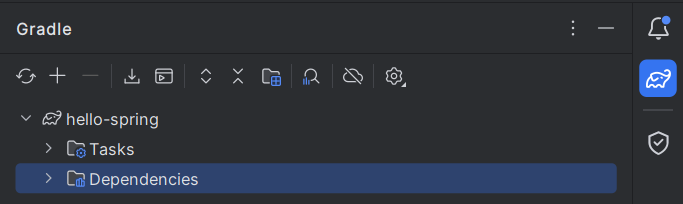

# 스프링 입문

## 1️⃣ 프로젝트 환경설정
### 01️ 프로젝트 생성
- Java 17
- IntelliJ

https://start.spring.io

**Project Metadata**
- Group : 기업 도메인명
- Artifact : build에 나올 때 결과물

**Dependencies**
- Thymeleaf : HTML을 만들어주는 템플릿 엔진

 

IntelliJ에서 `build.gradle` → `Open as Project`

- `.idea` : IntelliJ가 사용하는 설정 파일
- `gradle`
- `src`
    - `main`
        - `java` : 실제 패키지, 소스 파일
        - `resources` : Java 코드 파일 제외한 나머지 파일
    - `test` : 테스트 코드
- `build.gradle` : 중요!
    - mavenCentral() : 라이브러리를 받는 사이트

 

**HelloSpringApplication 실행**
- `Tomcat initialized with port 8080 (http)` → `localhost:8080`

 

Settings → gradle 검색 → `Build and run using` & `Run tests using` : `IntelliJ IDEA`

 

### 02 라이브러리 살펴보기

 External Libraries : 불러온 라이브러리들

 

gradle, Maven 같은 툴들은 의존관계를 다 관리해줌. (필요한 것 다 불러옴.)

 Dependencies : 라이브러리 간의 의존관계

 

**logging**
- `slf4j` : 쉽게 말해 인터페이스.
- 요즘엔 실제 로그를 어떤 구현체로 출력하느냐 → `logback`
- starter-logging 라이브러리를 불러오면 slf4j, logback 두 라이브러리도 자동으로 불러옴.

 

테스트할 때, JUnit 라이브러리 사용

 

| **정리**

**스프링부트 라이브러리**
- spring-boot-starter-web
    - spring-boot-starter-tomcat : 톰캣(웹서버)
    - spring-webmvc : 스프링 웹 MVC
- spring-boot-starter-thymeleaf : 타임리프 템플릿 엔진(View)
- spring-boot-starter(공통) : 스프링 부트 + 스프링 코어 + 로깅
    - spring-boot
        - spring-core
    - spring-boot-starter-logging
        -logback, slf4j

**테스트 라이브러리**
- spring-boot-starter-test
    - junit : 테스트 프레임워크
    - mockito : 목 라이브러리
    - assertj : 테스트 코드를 좀 더 편하게 작성하게 도와주는 라이브러리
    - spring-test : 스프링 통합 테스트 지원

 

### 03 View 환경설정
